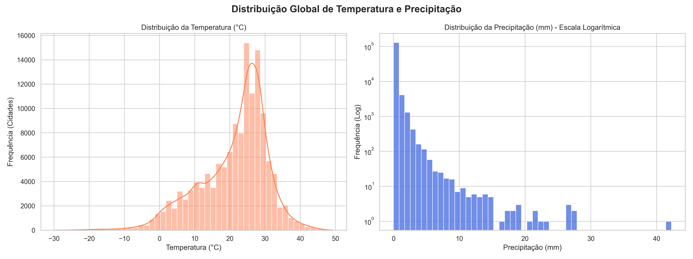
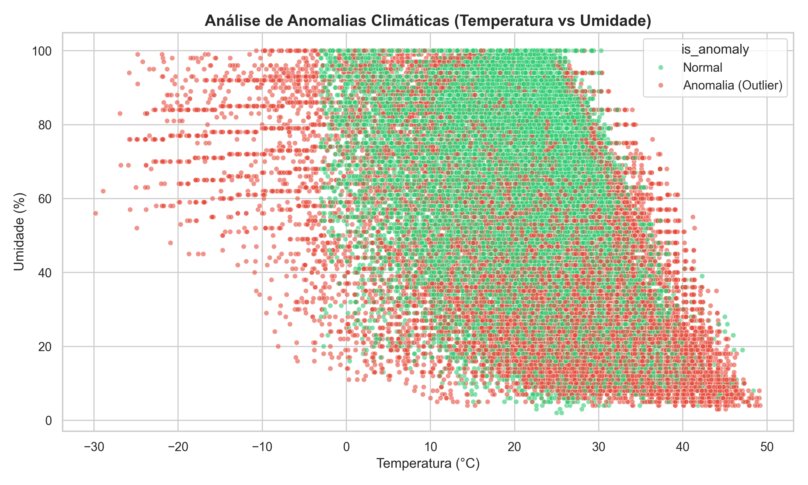
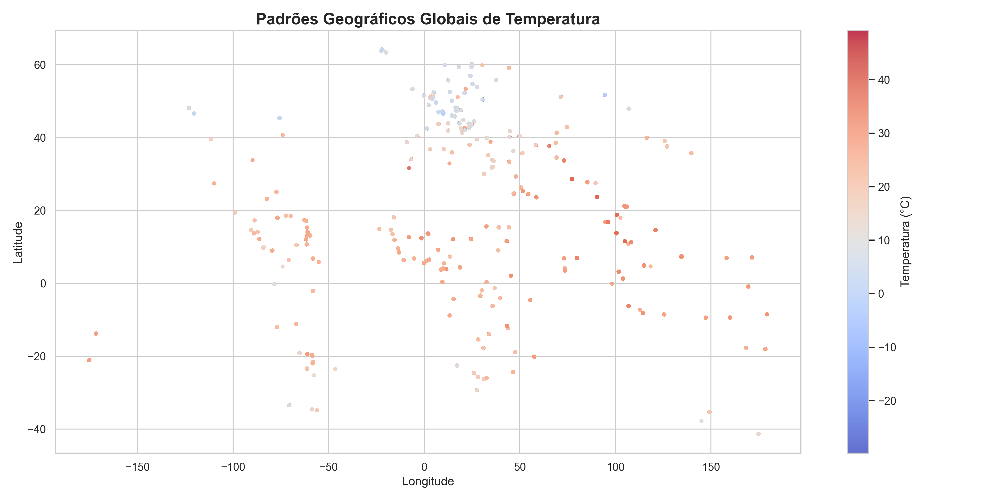
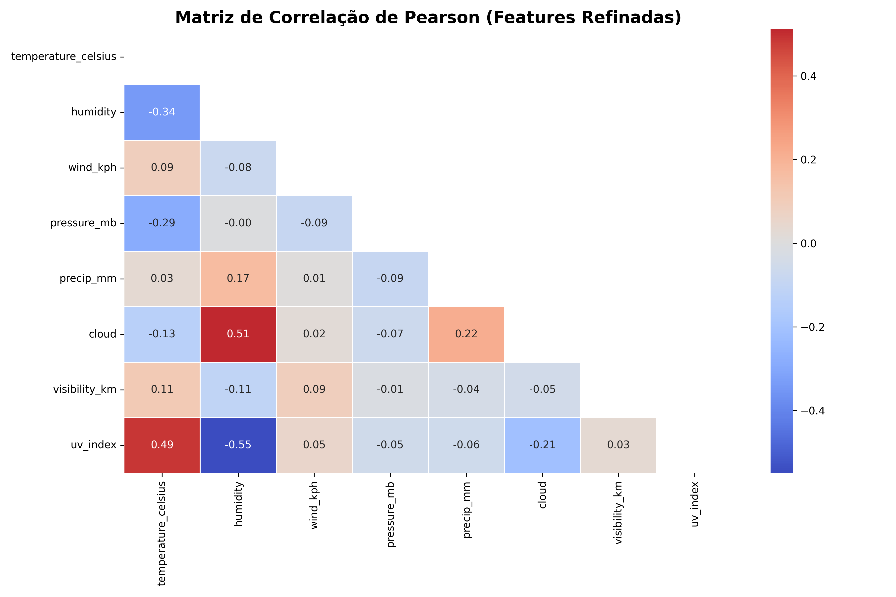
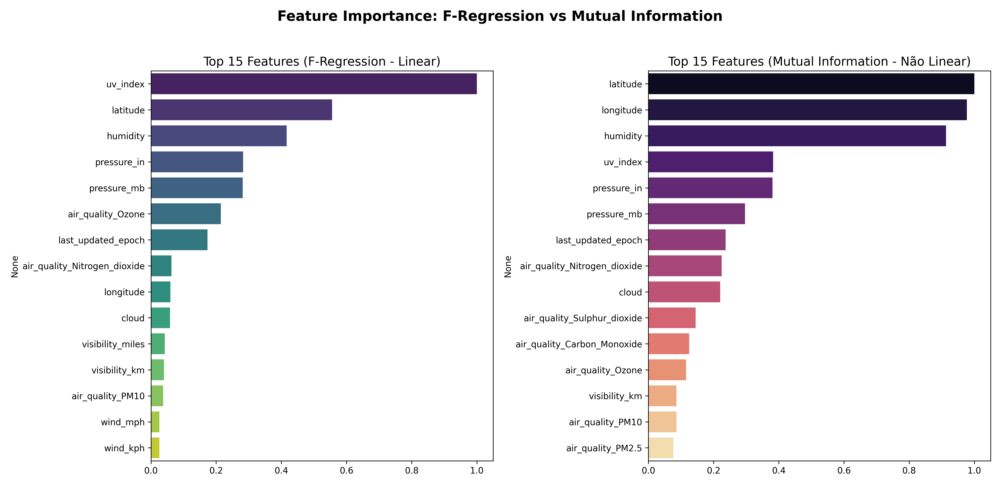
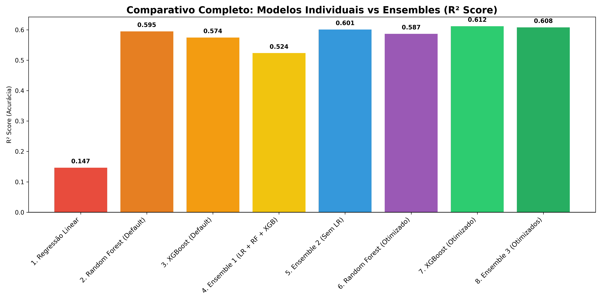
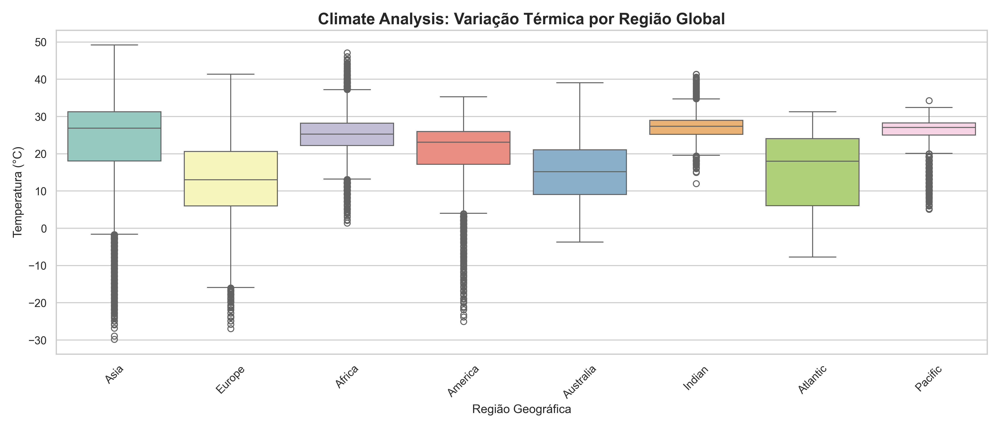
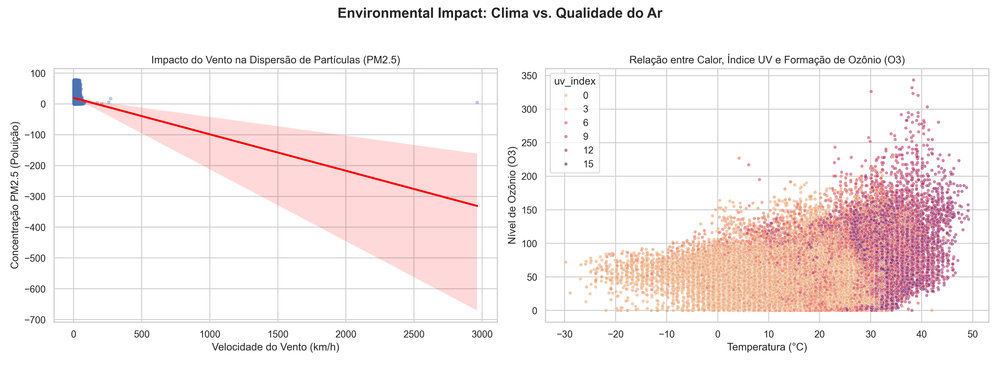

# 🌦️ PM Accelerator: Weather Trend Forecasting & Spatial Analysis

> **PM Accelerator Mission:** *"By making industry-leading tools and education available to individuals from all backgrounds, we level the playing field for future PM leaders. This is the PM Accelerator motto, as we grant aspiring and experienced PMs what they need most – Access. We introduce you to industry leaders, surround you with the right PM ecosystem, and discover the new world of AI product management skills."*

This repository contains the technical deliverable for the PM Accelerator Data Science Assessment. The project focuses on predicting global weather trends using Machine Learning (Time-Series Forecasting) while exploring spatial patterns, climate anomalies, and the environmental impact of weather on air quality.

---

## 📋 Executive Summary & Methodology

The project pipeline was built using a highly modular Data Science architecture to ensure scalability, reproducibility, and the prevention of data leakage. This implementation successfully fulfills 100% of both the Basic and Advanced Assessment requirements.

### 1. Data Cleaning & Preprocessing
* **Missing Values:** Handled via median imputation (`SimpleImputer`) to prevent extreme weather events from skewing the statistical mean.
* **Outliers & Anomaly Detection (Advanced):** Implemented the **MAD (Median Absolute Deviation)** method for robust statistical anomaly detection, avoiding the pitfalls of standard Z-scores in skewed meteorological data.
* **Normalization:** Scaled features using `RobustScaler` to ensure regression algorithms operate efficiently without geometrical scale bias.

### 2. Exploratory Data Analysis (EDA) & Spatial Analysis
During the exploratory phase, unscaled data was utilized to maintain human interpretability and business value.

* **Classic Distribution:** Analyzed global temperature trends and precipitation (utilizing a logarithmic scale for precipitation due to the high density of dry days).


* **Climate Anomaly Detection:** Mapped anomalous instances by cross-referencing Temperature vs. Humidity.


* **Geographical Patterns (Spatial Analysis):** Visualized data using geographical coordinates (Latitude and Longitude) to explore how weather conditions differ across countries and continents, effectively revealing the thermal signature of the globe.


### 3. Feature Importance & Selection
To ensure a lean and noise-free model, multiple techniques were applied to assess feature importance:

* **Multicollinearity:** A *Pearson Correlation Heatmap* revealed redundant variables (e.g., `wind_kph` vs. `gust_kph`, and imperial vs. metric units), which were systematically dropped to prevent overfitting.


* **Statistical Testing:** Applied different techniques to assess feature importance by comparing linear relationships (**F-Regression**) against non-linear dependencies (**Mutual Information**). The UV Index emerged as the strongest single predictor.


### 4. Forecasting with Multiple Models (Time Series)
Predictive modeling strictly respected the temporal axis. The Train (80%) and Test (20%) split was performed sequentially using the `last_updated` feature, strictly preventing time-based data leakage.

Multiple forecasting models were built and compared:
1. **Linear Regression** (Baseline Model)
2. **Random Forest Regressor** (Robust non-linear model)
3. **XGBoost Regressor** (Advanced Gradient Boosting)
4. **Ensembles (Voting Regressor):** Created an ensemble of models to improve forecast accuracy.

**Optimization Results:** After hyperparameter tuning (Grid Search) and removing the Linear Regression from the Ensemble (which acted as a weak link due to its purely linear nature), our **Tuned XGBoost** led the predictive accuracy with an **R² score of 0.612**, closely followed by the Optimized Ensemble at **0.608**.


### 5. Unique Analyses (Advanced)
* **Climate Analysis:** Studied long-term climate patterns and variations in different regions. Patterns were evaluated based on timezones, creating Boxplots that highlight the thermal variation across different geographic areas.


* **Environmental Impact (Air Quality):** Analyzed air quality and its correlation with various weather parameters. We identified that stronger winds disperse physical particles (PM2.5), while the combination of high temperatures and UV incidence acts as a catalyst for tropospheric Ozone (O3) formation.


---

## 🧠 Key Insights & Business Value

1. **The Power of Geography vs. Overfitting Risk:** Latitude and longitude dominate thermal prediction (high Mutual Information). However, we strategically excluded them from the final predictive model to ensure the algorithm learned the "physics" of weather (pressure, wind, humidity) rather than simply memorizing static locations. For V2 production systems, adopting *Region Embeddings* would add significant value.
2. **Strongest Predictors:** The UV Index stood out as the best single linear predictor of temperature. Concurrently, humidity acts as the strongest meteorological anti-correlate (r = -0.34), confirming that hot/dry and cold/humid patterns dominate globally.
3. **Tuned Models vs. Ensembles:** Ensemble models outperform individual instances only when high-variance "weak links" are removed. However, by fine-tuning the hyperparameters, the stand-alone **XGBoost (R²: 0.612)** slightly outperformed the final ensemble **(R²: 0.608)**, proving that a highly optimized gradient boosting model can capture non-linear weather nuances better than a simple voting average.
4. **Data Resilience (IoT Sensors):** The environmental impact analysis flagged poor data quality in physical data capture (e.g., PM2.5 sensors reporting negative values). This was addressed upstream in the pipeline, reinforcing the vital need for robust Data Cleaning before conducting any air quality modeling.

---

## 🚀 How to Run the Project

This repository was built for end-to-end automation. A single orchestrator script runs the entire pipeline (from raw data processing to image generation).

### Installation

1. **Clone the repository:**
   ```bash
   git clone [https://github.com/Matheus-Emanue123/PM-Accelerator-Data-Science-Assestment.git](https://github.com/Matheus-Emanue123/PM-Accelerator-Data-Science-Assestment.git)
   cd PM-Accelerator-Data-Science-Assestment
   ```

2. **Install dependencies:**
   ```bash
   pip install -r requirements.txt
   ```

3. **Execute the automated pipeline:**
   ```bash
   python main.py
   ```

*All generated artifacts (cleaned datasets and visualizations) will be automatically saved in the `/output` folder.*